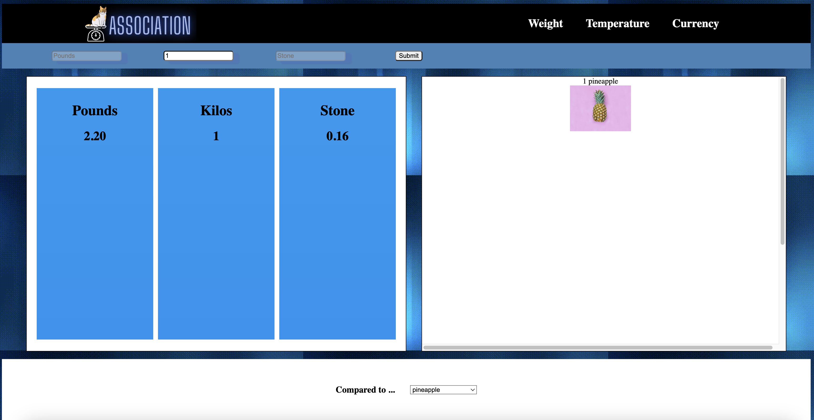
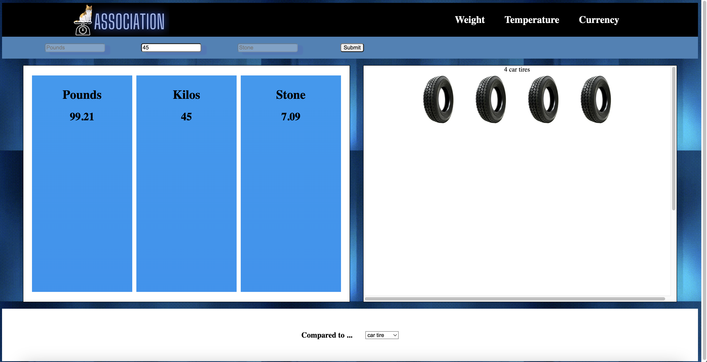

# Association

Unit conversion is hard, especially without any real-world points of reference. So we created <strong>Association</strong>, which not only does unit-conversion but provides a picture of common object. Something you can put your hands on! You can compare the input weight to a host of other objects.

 

 

 

